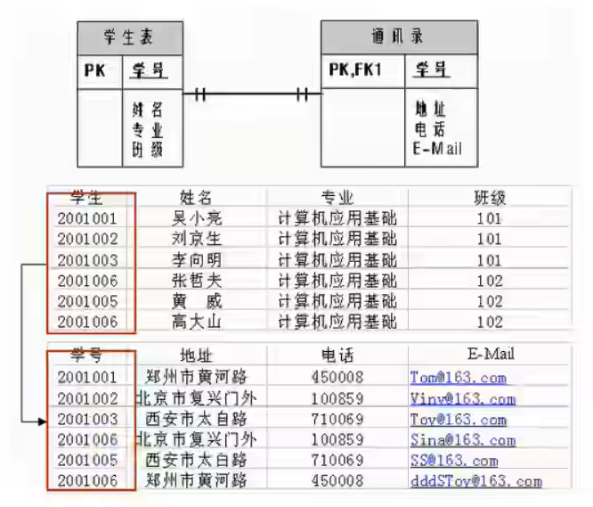
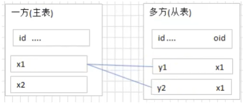
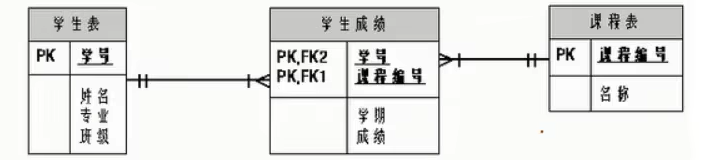
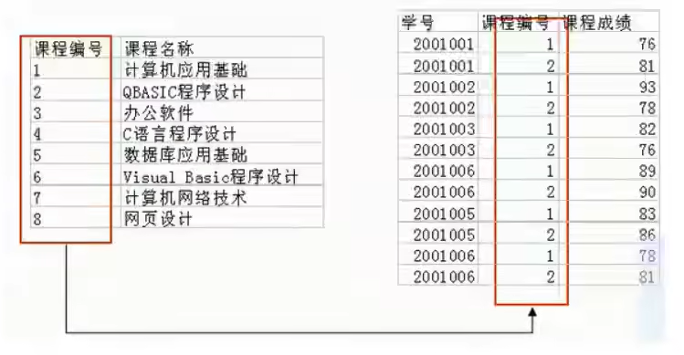
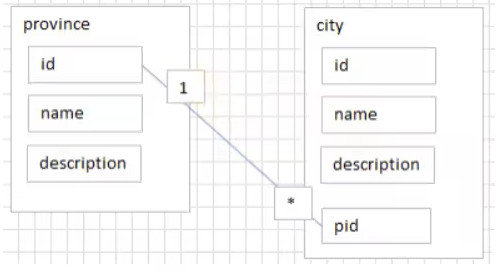
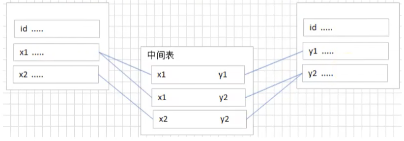
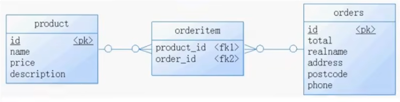
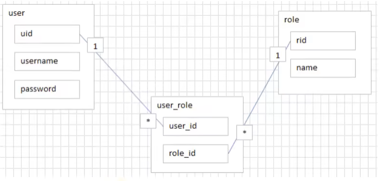
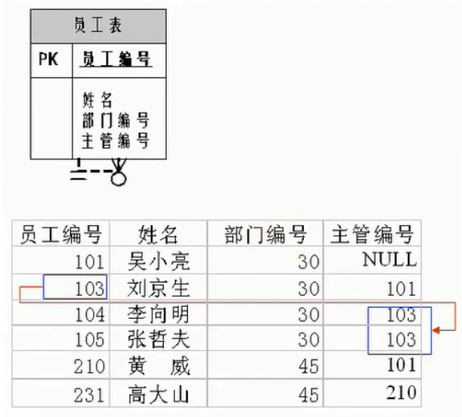

# MySQL教程 尚硅谷

> author:entrycoder  
> create at : 2022-12-06    21:36 GMT +8  
> update at : 2022-12-09    00:40 GMT +8  


### **一、前情导入**
1.数据库是为了便于查找数据与修改数据而存在的。

2.常用的数据库可以分为“关系型数据库”与“非关系型数据库”，也可以分别叫做SQL与NoSQL。

3.常见的关系型数据库有：Oracle（收费）、MySQL（社区版免费，商业版收费）、PostgreSQL（免费）、MariaDB（免费）。常见的非关系型数据库有：Redis（免费）、ElasticSearch（免费）。

4.NoSQL对SQL进行了很好的补充，对于要求高性能、并且不要求完整的关系型数据库时，可以使用NoSQL。比如“日志收集”、“排行榜”、“定时器”等。

### **...其他省略**

### **五、关系型数据库设计规则**
#### 5.1 表、记录、字段
- E-R(entity-relationship，实体-联系) 模型中有三个重要的概念：实体集、属性、联系集
- 一个实体集(class)对应数据库中的一个表(table)，一个实例(instance)则对应数据库表中的一行(row)，也称为一条记录(record)。一个属性(attribute)对应数据库表中的一列(column)，也称为一个字段(field)。

```
ORM思想(Object Relational Mapping)体现：
数据库中的一个表 <---> Java或Python中的一个类
表中的一条数据 <---> 类中的一个对象(或实例)
表中的一个列 <---> 类中的一个字段、属性(field)
```

#### 5.2 表的关联关系
- 表与表之间的数据记录有关系(relationship)。现实中各种实例及实例之间的各种联系均用关系模型来表示。
- 四种关系：一对一关联、一对多关联、多对多关联、自我引用

##### 5.2.1 一对一关联(one-to-one)
- 实际开发中应用不多，因为一对一可以创建为一张表。
- 举例：设计`学生表`：学号、姓名、手机号、班级、系别、身份证号、家庭住址、籍贯、紧急联系人、...
    - 拆为两个表：两个表的记录为一一对应关系。
    - `基础信息表`(常用信息)：学号、姓名、手机号、班级、系别
    - `档案信息表`(不常用信息)：学号、身份证号、家庭住址、籍贯、紧急联系人、...

- 两种建表原则：
    - 外键唯一：主表的主键和从表的外键(唯一)，形成主外键关系，外键唯一。
    - 外键是主键：主表的主键和从表的主键，形成主外键关系。
    

##### 5.2.2 一对多关系(one-to-many)
- 常见实例场景：`客户表和订单表`，`分类表和商品表`，`部门表和员工表`。
- 举例：
    - 员工表：编号、姓名、...、所属部门
    - 部门表：编号、名称、简介
- 一对多建表原则：在从表(多方)创建一个字段，字段作为外键指向主表(一方)的主键





##### 5.2.3 多对多(many-to-many)
要表示多对多关系，必须创建第三个表，该表通常称为`联接表`，它将多对多关系划分为两个一对多关系，将这两个表的主键都插入到第三个表中。


- **举例1：学生.课程**
    - `学生信息表`：一行代表一个学生的信息(学号、姓名、手机号码、班级、系别...)
    - `课程信息表`：一行代表一个课程的信息(课程编号、授课老师、简介...)
    - `选课信息表`：一个学生可以选择多门课，一门课可以被多个学生选择

    | 学号 | 课程编号 |
    | :---: | :---: |
    | 1 | 1001 |
    | 2 | 1001 |
    | 1 | 1002 |

- **举例2：产品.订单**
“订单”表和“产品”表有一种多对多的关系，这种关系是通过与“订单明细”表建立两个一对多关系来定义的。一个订单可以有多个产品，每个产品可以出现在多个订单中。
    - `产品表`：“产品”表中的每条记录表示一个产品。
    - `订单表`：“订单”表中的每条记录表示一个订单。
    - `订单明细`：每个产品可以与“订单”表中的多条记录对应，即出现在多个订单中。一个订单可以与“产品”表中的多条记录对应，即包含多个产品。
    


- **举例3：用户.角色**
- 多对多关系建表原则：需要创建第三张表，中间表中至少两个字段，这两个字段分别作为外键指向各自一方的主键。



##### 5.3.4 自我引用(Self reference)

