# 在Kylin OS上安装VUE_CLI环境

> author:entrycoder

> create at : 2022-08-15    23:36 GMT +8

> update at : 2022-09-03    21:03 GMT +8


参照内容
> 单位网络管理员讲解

> [https://blog.csdn.net/kingchen2010/article/details/120473243](https://blog.csdn.net/kingchen2010/article/details/120473243)
> [https://www.php.cn/vuejs/481497.html](https://www.php.cn/vuejs/481497.html)


### 〇、前提说明
1.本次实操使用root用户，避免各类权限问题

如果使用其他用户操作遇到了权限问题，可以在命令前加sudo，意为暂时使用系统管理员身份执行命令

如
```
$ sudo vi /etc/profile
```

### 一、包下载
首先应当下载linux版本的node包(https://nodejs.org/en/download/),此处以LTS版本的node-v16.17.0-linux-x64.tar.xz为例进行说明

注意要下载linux版本的包，可以下载至windows电脑，之后传输至linux电脑。也可以直接在联网的linux电脑中下载

本次测试选择下载至windows电脑中，之后使用工具传输至linux的方式进行

传输方式如图
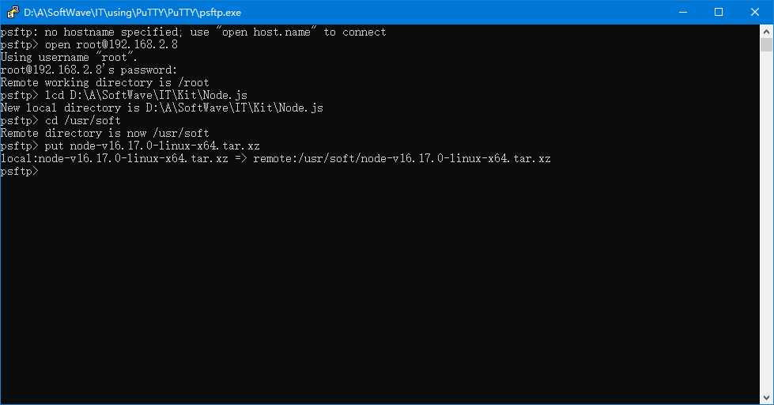

### 二、检查系统原本环境
1.在正式配置下载的node之前，应当先检查本系统的环境，确认不存在其他版本的node以及npm，以免冲突

检查node版本，使用
```
$ node -v
```

检查npm版本，使用
```
$ npm -v
```

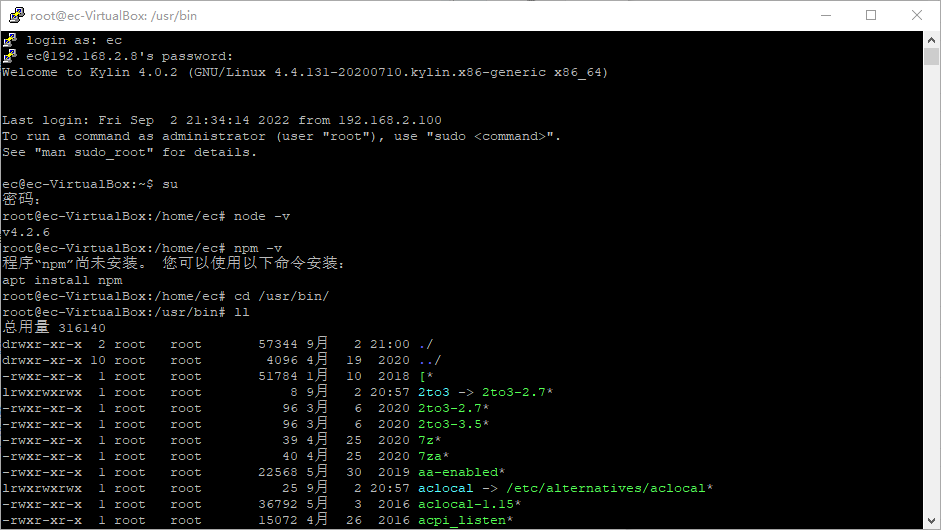

此处以root用户登录，因此命令分别是
```
# node -v
# npm -v
```
$ 和 #仅代表登录的用户不同，并非手动输入的字符

2.切换至/usr/bin路径下
```
$ cd /usr/bin/
```
3.查看当前路径中的文件、文件夹以及对应关系
```
$ ll
```

4.找到node命令对应的文件，如果有链接，将链接一并删除
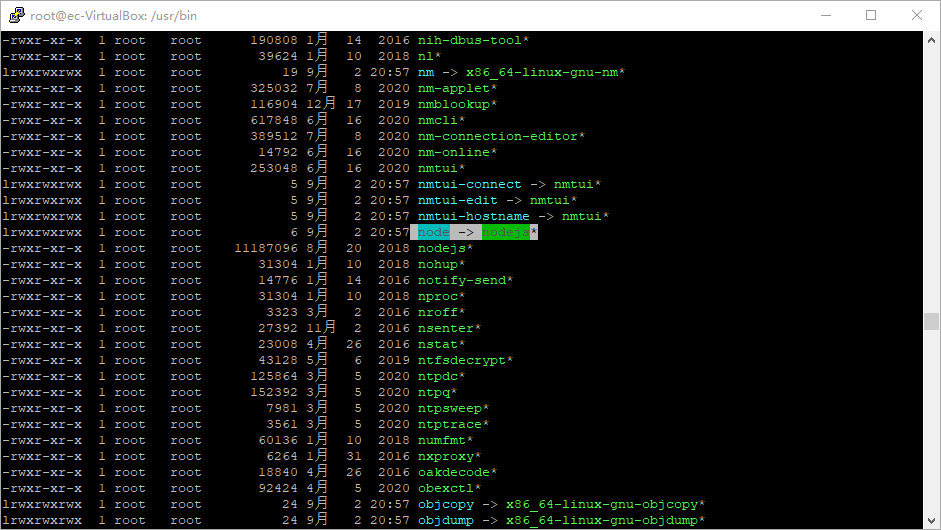

删除命令
```
$ rm ./node
$ rm ./nodejs
```
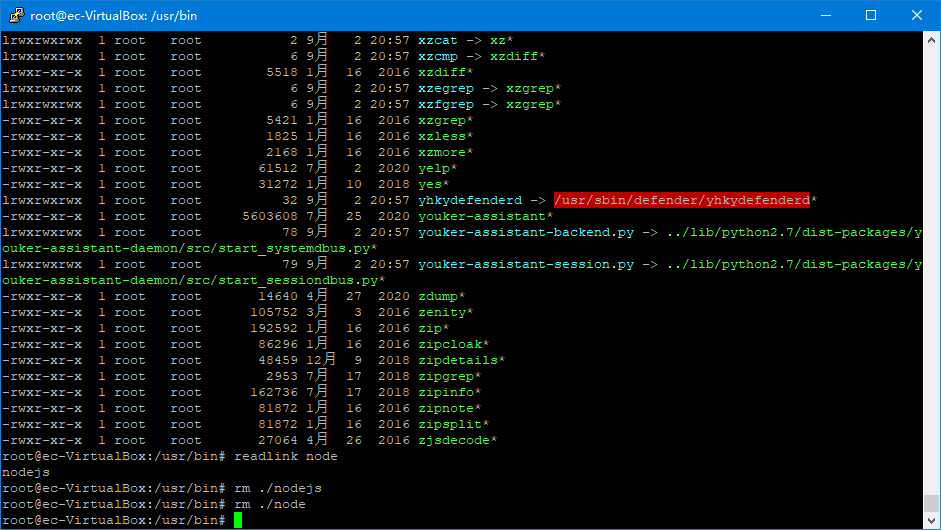

删除完成后，再次确认node版本，此时回提示未找到node，说明node已经被删除
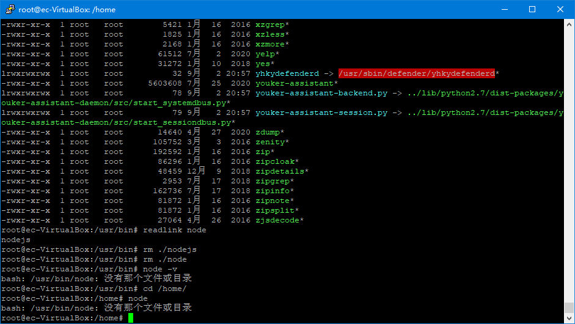

### 三、准备新的node环境
1.为避免权限问题造成无法识别可执行文件，先给文件夹赋予权限
```
$ chmod 777 /usr/soft
```
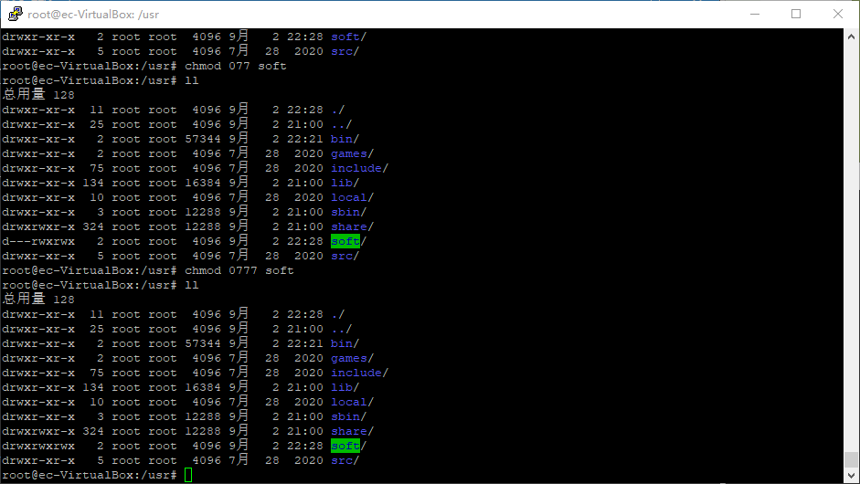

2.切换至/usr/soft文件夹下，
使用命令
```
$ ll
```
可以看到之前传送的文件
node-v16.17.0-linux-x64.tar.xz
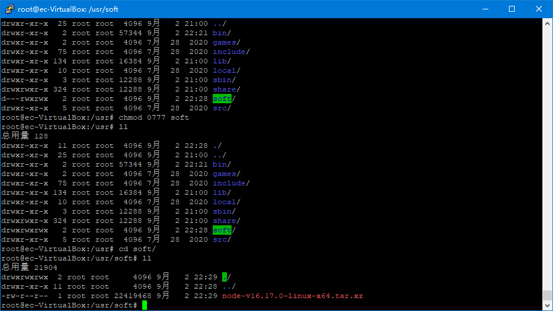


3.根据文件名*.xz判断，此文件未使用gzip压缩，仅打包

因此使用
```
$ tar -xvf node-v16.17.0-linux-x64.tar.xz
```
解压文件
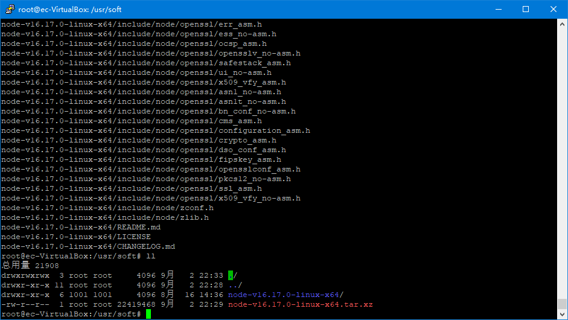

4.解压后的文件夹名称过长，不方便后续填写，因此进行重命名
```
$ mv node-v16.17.0-linux-x64 node
```
此行命令意为：将当前目录下的node-v16.17.0-linux-x64 文件夹，移动至当前目录下，并且移动后的名称为 node

5.同样给当前文件夹下的node文件夹赋予权限
```
$ chmod 777 node
```
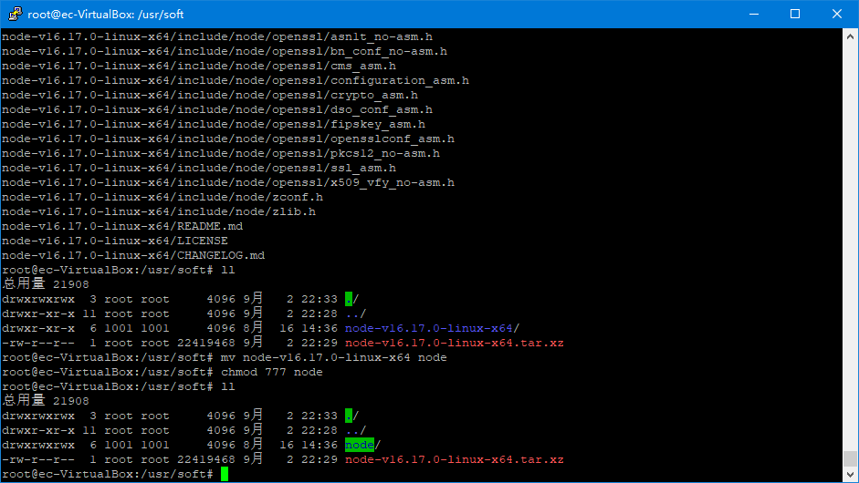

6.将当前文件夹下的./node/bin添加至环境变量中，方便用户使用
```
$ vi /etc/profile
```
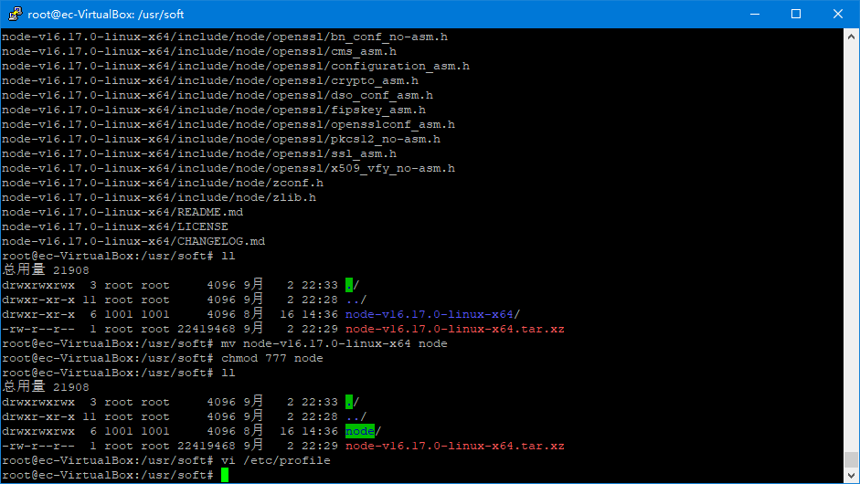
在文件末尾输入i进入插入模式，或者双击o直接插入新行

之后输入
```
export PATH=$PATH:/usr/soft/node/bin/
```
这行的意思是 

输出(export)环境变量(PATH)，内容是(=)：原本的环境变量($PATH)，加上(:为分隔符，在windows操作系统的环境变量中使用;)新的路径(此处为/usr/soft/node/bin/)

按下ESC键退出输入模式

按下:wq这三个按键写入文件并退出

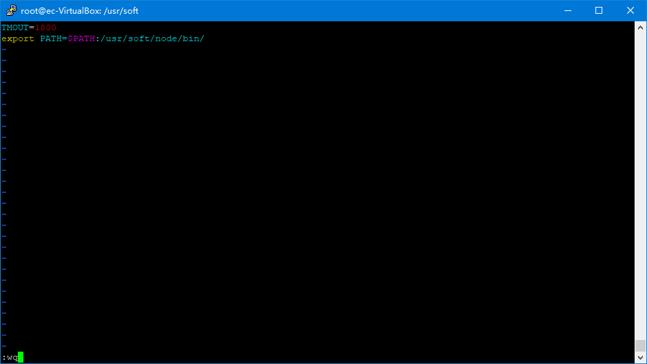

7.此时如果直接使用
```
$ node -v
```
命令，仍然可能无法找到，因为环境还未刷新

使用
```
$ source /etc/profile
```
刷新环境变量

再次使用
```
$ node -v
$ npm -v
```
即可看到对应的版本

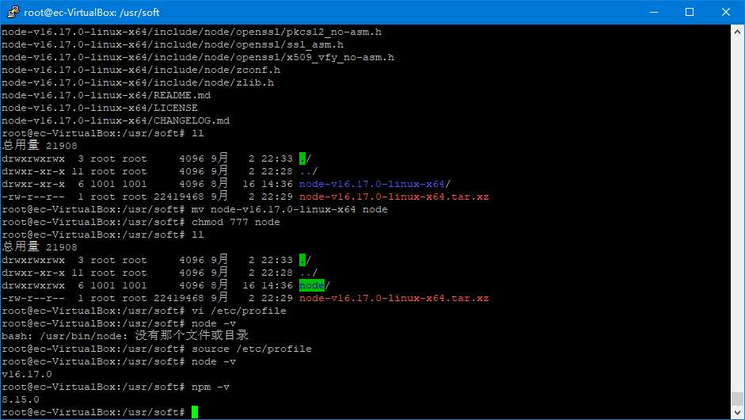

### 四、依赖包安装
1.为使用其他依赖包，可以通过
```
$ npm install [packageName]
```
进行依赖包的安装

默认安装至当前目录的node_modules目录下，因此切换至/usr/soft/node/lib/目录下进行安装
```
$ cd /usr/soft/node/lib/
```

因实际操作问题，此处先对npm版本进行了升级，命令同安装其他依赖包
```
$ npm install npm
```
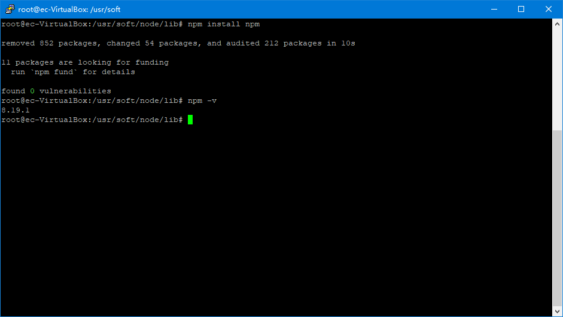

如果依赖包长时间无法下载，或者提示网络问题，可以使用加速器，或者切换至国内镜像源进行下载安装。此次操作使用加速器进行下载

之后安装的包为@vue/cli，因此命令为
```
$ npm install @vue/cli
```

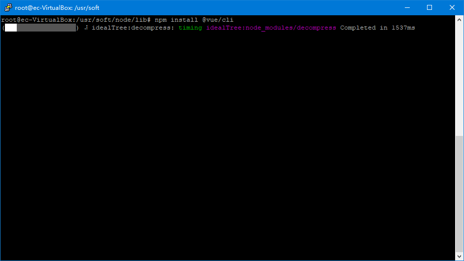

安装完成后可以看到修改或者添加了一些包(packages)
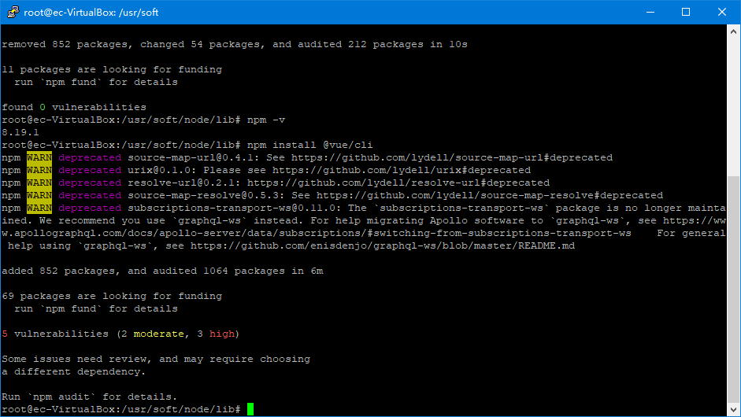
出现告警(WARN)暂时无需理会

2.此时如果/usr/soft/node/bin/目录下未多出一些其他可执行文件，有两种可能

(1)下载的包本身就不是可执行文件(可执行二进制文件)

(2)下载的包中包含的可执行文件未放在node/bin/目录下

对于情况(1)，项目中使用时引入js文件即可

对于情况(2)，可以将包依赖中的/bin目录下的可执行文件链接至/usr/soft/node/bin/目录下

此处以vue/cli为例
```
$ ln -s /usr/soft/node/lib/node_modules/@vue/cli/bin/vue.js /usr/soft/node/bin/vue
```
命令的意思为 

在/usr/soft/node/bin/目录下创建一个名为vue的链接，指向 /usr/soft/node/lib/node_modules/@vue/cli/bin/vue.js文件

因为/usr/soft/node/bin/已经添加至环境变量，因此系统可以直接识别vue命令
使用
```
$ vue -V
```
可以看到@vue/cli的版本

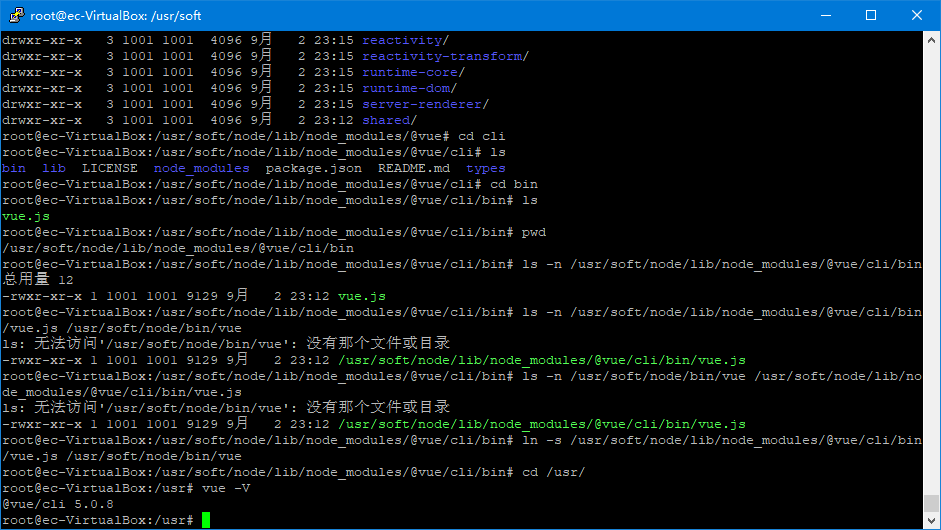

注意：链接的名称是自定义的(此处自定义为vue)

### 五、转移至其他kylin电脑
1.使用tar -cvf /usr/soft/node node.tar.xz将已经装好的文件进行打包

2.将打包好的文件 node.tar.xz 传入其他kylin电脑中

3.参照前文进行环境的配置即可使用